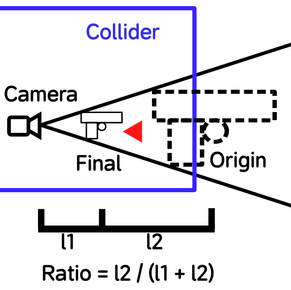

## Attention! UE 5.6 has implemented simular function
If you are using UE 5.6 or above version, there is no need to modify material but only set camera and mesh with settings below will get same effect:

Camera Settings:

Arm or Weapon Settings:

For more details, watch this vedio:
https://www.youtube.com/watch?v=11sLIyw0pWQ

# Best way to fix FPS gun clipping for UE
This project shows how to fix FPS gun clipping porblem in Unreal Engine by modify material, it's simple and adjustable.

Compared to other methods, this approach offers greater flexibility and closely mirrors the original model's display, including the ability to render shadows without any abnormalities caused by changes in the camera's FOV or screen aspect ratio, such as during the transition to aiming mode.

The "Ratio" parameter can be adjusted within the range of \[0,1). A lower value closely approximates the original display effect, but is more prone to clipping issues. Conversely, a higher value reduces clipping but also introduces greater deviations in the shadow effect.

We can also dynamically adjust these parameters. For instance, we can utilize rays to maximize the Ratio when clipping is detected, and set it to 0 when no clipping issues arise.

This method is also compatible with other engines, including Unity and Godot.

## Mainly material modification

You can copy code from file "CopyCodeForUEMaterial.txt" then paste it directly into UE material editor. Need to modify all arm and weapon materials.

## What the modification has done

This method solve the clipping problem by shorten the distance from mesh vertexs to camera, so that we can keep all vertexs inside collider to avoid clipping problems.

